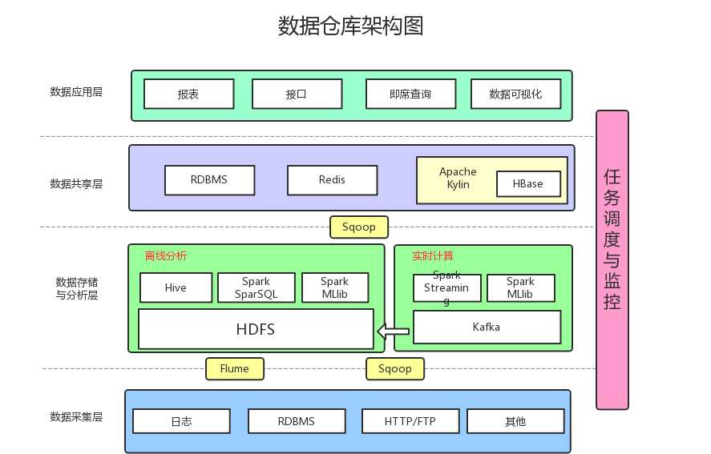

## 数仓基本知识
### 数据仓库定义
    面向主题,集成,非易失去,随时间变化的**数据集合**
    面向主题:为数据分析提供服务,根据主题将原始数据集合在一起(用户表、商品表、行为表 聚合成用户购买行为表)   
    集成: 原始数据来源不同数据源(mysql/oracle/log),要整合成最终数据,经过ETL的过程
    非易失:保存的数据是一系列历史快照,不允许被修改,只允许通过工具进行查询分析
    时变性:定期接收新的数据,从而反映历史变化
|      | 数据库  | 数据仓库  | 数据集市  |
|  ----  | ---- | ----  | ----  |
| 面向  | 事务(OLTP) | 面向分析决策(OLAP) | 面向分析决策(OLAP) |
| 数据特点   | 当前最新的 | 历史的,跨时间维护 | 历史的,跨时间维护 |
| 设计模型   | 基于ER模型,面向应用 | 星形/雪花模型 | 星形/雪花模型 |
| 数据特点   | 当前最新的 | 历史的,跨时间维护 | 历史的,跨时间维护 |
| 表  | 避免冗余,符合范式 | 反范式,冗余 | 历史的,跨时间维护 |

 $\color{red}引发问题1:数仓模型和集市模型的区别？$
#### 数据仓库数据集市区别
     数据仓库面向整个企业,数据集市面向业务线、部门
     数据集市分为独立型(来源操作系统),从属型(来源数据仓库)
 $\color{red}引发问题2:先做数据仓库还是先做数据集市？$
#### 传统数据仓库(MPP 大规模并行处理)  
     1.每个节点本质上还是一个数据库,并且还是独立计算(Share Nothing),如果需要数据交换,需要高速网路(专用网络或者商业网络)与其他节点进行连接(有节点上线)
     2.存储需要分表,分表粒度越细处理数据时性能越差
     3.数据热点问题,加入某一个节点数据会被频繁访问,就会导致该节点压力过大(可以打乱数据分布,将热点数据分散)
     4.延迟低吞吐低,适合中等规模的结构化数据处理
     5.产品: DB2,GreenPlum 
#### 大数据数据仓库(分布式文件系统)
     1. 移动计算而非移动数据(批处理),每个节点通过局域网连接,数据访问透明,共享数据以及内存
     2. 扩展性良好(数据当做文件进行拆分存储(128M))
     3. 数据热点(一份数据默认被分为3份进行存储)得以解决
     4. 分布式架构,不支持事务查询(即席查询可用presto)
     5. Hive,Hbase(非机构、半结构),TiDB,Impala(MPP架构的数据查询引擎)
### 数据仓库架构

     1.ETL(Extract-transform-load) :sqoop,datax...
     2.ODS层:操作数据源层,贴源,满足数仓历史数据不易失特性
       DWD层:明细数据层,根据业务主题进行划分 -- 满足三范式
       DWS层:汇总数据层,大宽表,能够支持大部分数据分析 -- 维度建模
       DM层: 数据集市层,可分为dmd/dms/app
 $\color{red}引发问题3:数仓分层与集市分层区别(本质上同问题1)？$

 ### 数仓搭建过程
 #### 1.确定业务过程
       根据业务过程来验证数据准确性,可靠性,确定操作系统源数据的更新逻辑以及存储逻辑
       从而确定该业务过程在操作系统的数据流向
 #### 2.确定粒度
       确定该表的唯一主键,后续的维度,指标都应根据主键来设计
 #### 3.确定维度
       确定业务过程中涉及的数据维度,需要考虑全面
 #### 4.确定指标(度量)
       确定业务过程涉及到的指标
### 搭建数仓的好处
    良好的数据模型能够极大减少不必要的数据冗余,能够实现计算复用,极大降低存储计算成本
    良好的数据模型能够提高用户的使用体验,提高数据问题查询效率,便于快速定位问题
    良好的数据模型能够保证数据指标口径的统一,减少相同指标不同结果的情况