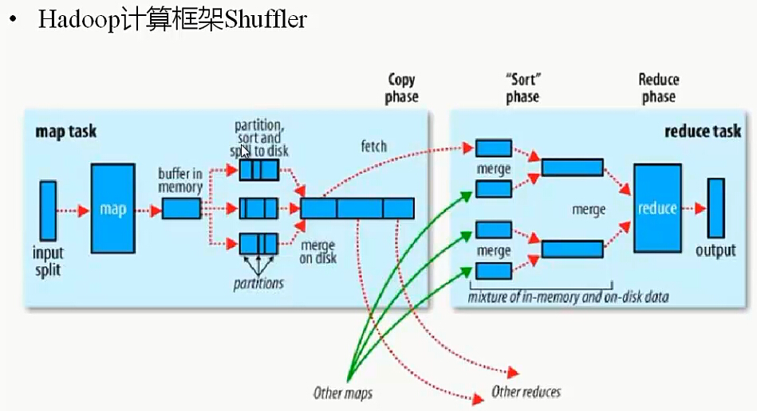
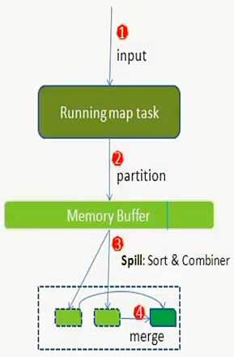
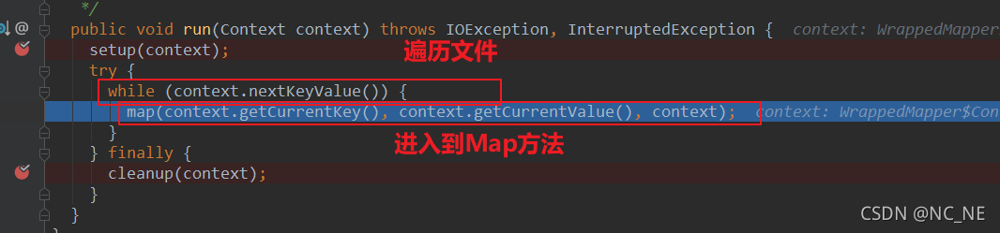
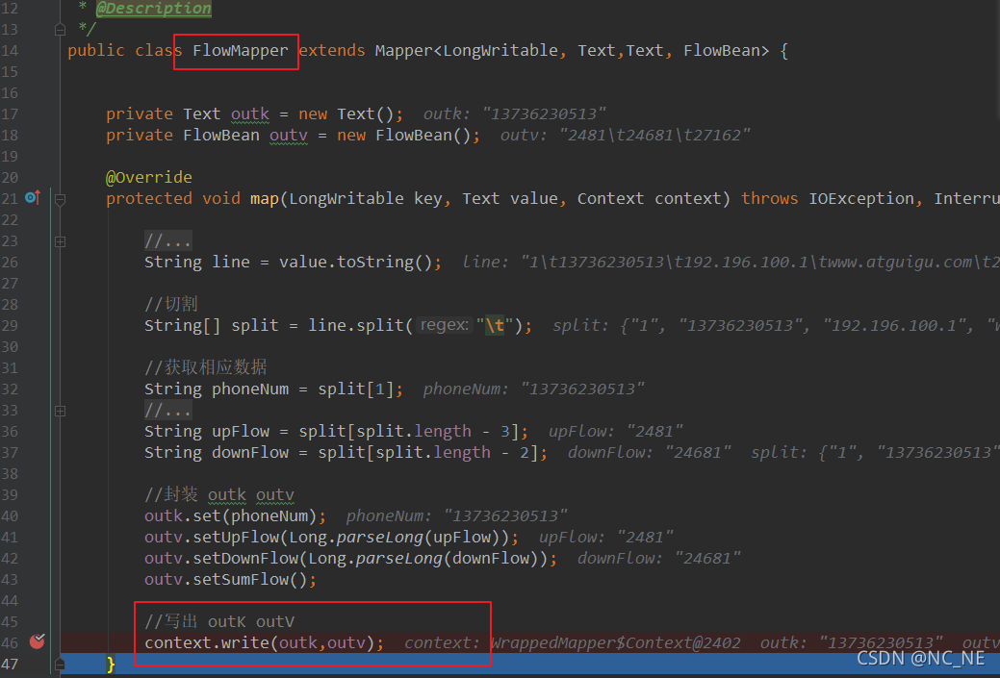
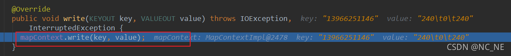
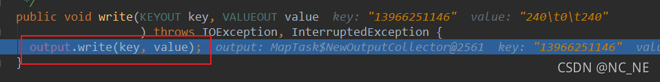
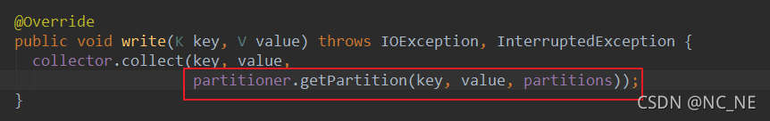
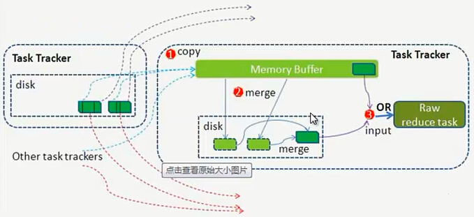

### Mapreduce 过程详解

      Shuffle过程,也称Copy阶段.reduce task从各个map task上远程拷贝一片数据,并针对某一片数据,如果其大小超过一定的阀值,则写到磁盘上,否则直接放到内存中.
      官方的Shuffle过程如上图所示,不过细节有错乱,官方图并没有说明partition、sort和combiner具体作用于哪个阶段.
      注意:Shuffle过程是贯穿于map和reduce两个过程的！
      Hadoop的集群环境,大部分的map task和reduce task是执行在不同的节点上的,那么reduce就要取map的输出结果.那么集群中运行多个Job时,task的正常执行会对集群内部的网络资源消耗严重.虽说这种消耗是正常的,是不可避免的,但是,我们可以采取措施尽可能的减少不必要的网络资源消耗.另一方面,每个节点的内部,相比于内存,磁盘IO对Job完成时间的影响相当的大
      所以:从以上分析,shuffle过程的基本要求:

      　　1.完整地从map task端拉取数据到reduce task端

      　　2.在拉取数据的过程中,尽可能地减少网络资源的消耗

      　　3.尽可能地减少磁盘IO对task执行效率的影响

      那么,Shuffle的设计目的就要满足以下条件:

      　　1.保证拉取数据的完整性

      　　2.尽可能地减少拉取数据的数据量

      　　3.尽可能地使用节点的内存而不是磁盘

https://www.cnblogs.com/felixzh/p/4680808.html  
$\color{red}说明:map节点执行map task任务生成map的输出结果.$

#### Map过程
     代码过程:
     1. 调用Mapper中的run()方法(利用Recordreader读取数据)
     run(){
        while(context.netKeyvalue()){
             map(key,value)
        } 
     }
     -- 初始化可以使用Mapper中的setup()方法
     2. map方法中使用context.write()方法将结果输出到环形缓冲区
     3. write方法先调用Mapoutputcollector.collect(),且调用partitioner获取改key属于哪个分区,按照key的hash值进行分区(对key hash后再以reduce task数量取模，返回值决定着该键值对应该由哪个reduce处理)
     4. 至此会将key/value 以及分区的结果写入环形缓冲区,
     5. collect中再调用spillthread().run()方法中的sortAndSpill()对数据进行排序以及溢写到磁盘,如果设置了combiner,会将相同的key的value进行合并,减少溢写到磁盘的数据量
     6. map()结果输出到环形缓冲区(默认100M)
     逻辑过程:
     1. map task任务执行,输入数据源为HDFS上的block;map task读取的是split 切片.split切片与block默认为一对一的关系,也有可能是多对一
        block(物理划分):
        文件上传hdfs后,会被划分成数据块(物理划分),按照128M的默认大小将文件切分,同一个数据块会被默认冗余存储3份,当修改block的默认大小后,新上传的文件会按照新的block大小进行划分,以前上传的文件还是之前的block大小
        split(逻辑切块):
        mapreduce中的split切块是逻辑上的划分,目的是为了map task更好的获取数据,具体的split切片大小(spliteSize=max(minSize,min(maxSize,blockSize)))
     2. map执行之后得到key-value对,调用partitioner接口,对kv对进行分区处理(默认:对key hash,再以reduce task数进行取模,决定哪个kv交给哪个reduce处理)   这种默认的分区方式,是为了平均reduce的处理能力,防止数据倾斜,保证负载均衡
     3. 将分区后的数据写进环形缓冲区(批量收集map结果,减少数据io,整个环形缓冲区是一个字节数组),   环形缓冲区的默认大小为100M,当maptask的输出很多并且装满环形缓冲区的80%时,会将数据以临时文件的方式写入磁盘(spill 溢写)-- 有单线程完成,不影响数据继续写入环形缓冲区
     4. 当spill线程启动时,会对80M的数据中的key进行排序(sort)-- sortAndSpill() 方法
     5. 如果设置了combiner方法,其会将相同key的kv对进行合并,减少溢写到磁盘的数据量,但是这并不能保证map的结果中所有相同的key都进行合并了,combiner的作用范围之后80M的环形缓冲区   combiner能保证每个溢写的临时文件中的key是唯一的
     6. 溢写生成的文件会随着maptask的输出结果数量增大而变多,当整个maptask都完成时,内存中的数据会全部溢写到一个文件中   也就是说溢写过程中产生的临时文件最终会归并成同一个文件(merge,得到结果如:{"A",[1,1,1,2]}),如果设置了combiner方法,也会调用combiner来合并key值(最后一个maptask中的溢写文件同一个key只有一个) -- 分区有序,但是整个文件无序
     7. map端结束          

·

 #### Reduce过程 
      逻辑过程:
      1. copy过程,启动copy进程(默认10),通过http方式请求map task所在的taskTrack获取maptask的输出文件(都在本地磁盘中)
      2. Merge阶段: 与map端的merge相同,只是将来源不同的map; copy来的数据会先放入内存缓冲区,这里的内存缓冲区是基于jvm的heap Size设置,因为shuffle阶段不需要执行reduce方法,因此绝大部分内存都可以被shuffle使用
      3. merge有三种形式(内存到内存,内存到磁盘,磁盘到磁盘),默认情况下第一种不使用;   第二种方式:在copy数据时内存使用到一定数据量,就会启动内存到磁盘的merge(溢写);如果设置了combiner,也会调用combiner;磁盘中会生成多个文件,merge一直在运行,直到没有map数据时才结束,然后启动第三种磁盘到磁盘的方式生成最终的文件
      4. 随着溢写文件的增多,后台线程会将他们合并成一个更大的有序文件
      5. 合并的过程会产生许多中间文件(写入磁盘),但是mapreduce会让写入磁盘的数据尽可能的少
      6. reduce的输入文件:在不断的merge之后会最终生成一个最终文件(磁盘或者内存中),默认情况数据是在磁盘中的,当reduce输入文件确定,整个shuffle才结束,然后启动reduce函数,最终结果放在hdfs上
   
$\color{red}说明:对MapReduce的调优在很大程度上就是对MapReduce Shuffle的性能的调优.$

reduce task并不一定是要等全部的maptask完成后才能进行,而是在一部分maptask完成后就开始启动,但是并不是做计算,而是拉取数据

 

#### shuffle的工作内容
     map端: 从运算效率来看,map输出的结果优先存储在map节点的内存中.每个map task都有一个内存缓冲区(默认100M),当缓冲区使用80%时,需要将缓冲区数据以临时文件的方式存到磁盘,当整个map task结束后,再对磁盘中的所有临时文件进行合并生成最终的输出文件.最后等待reduce task来拉取数据
     reduce端:不断拉取当前job里的每个maptask的最终结果,并对不同map拉取过来的数据进行merge操作,最终会形成一个文件作为reduce task的输入文件

      

### 并行度:一个MR程序中maptask和reducetask的任务量
#### Maptask的并行度决定机制(每个maptask处理一个逻辑切片)
    1. splitsize:blocksize,maxsize,minsize的中间值决定切片大小(min(blocksize,max(maxsize,minsize)))
    2. 不论如何调整参数,都不能将多个小文件划入一个split

### MapReduce的核心三大组件(在shuffle中起作用)
#### partitioner
     对maptask结果数据按照key值的某个值(如hash进行分区操作),并且设置reducetask分区(默认hashpartition)
     按照key分别映射给不同的reduce，也是可以自定义的
     是在环形缓冲区中进行分区
#### combiner
##### 1.定义:
      Combiner是mapreduce中Mapper和reducer之外的一个组件,作用于maptask之后对maptask的输出结果进行局部汇总,减轻reducetask的计算负载,减少网络传输
##### 2.使用: 
      Combiner与reducer是一样的,只是作用在maptask的节点
##### 3.Combiner与Reducer的区别
      1.combiner是在每一个maptask节点上运行,reducer是接受全局maptask的输出结果
      2.combiner的输出键值对与reducer接受的键值对保持一致
      3.Combiner 的使用要非常谨慎,因为 Combiner 在 MapReduce 过程中可能调用也可能不调 用,可能调一次也可能调多次,所以: Combiner 使用的原则是:有或没有都不能影响业务 逻辑,都不能影响最终结果(求平均值时,combiner和reduce逻辑不一样)
#### sorter
     如果需要对key值进行排序时,可以直接排序; 但是当需要对value中某个字段排序时,将字段提升到key中,重新实现sort方法进行排序

### MapJoin 和 ReduceJoin 
#### 1.ReduceJoin(common join)
     如果不指定MapJoin或者不符合MapJoin的条件,那么hive会解析器会将join操作转化成common join (在reduce 中完成reduce完成join)
     Map阶段
     读取源表的数据,Map输出时候以Join on条件中的列为key,如果Join有多个关联键,则以些关联键的组合作为key;
     Map输出的value为join之后所关心的(select或者where中需要用到的)列；同时在value中会包含表的Tag信息,用于标明此value对应哪个表；
     按照key进行排序

     Shuffle阶段
     根据key的值进行hash,并将key/value按照hash值推送至不同的reduce中,这样确保两个中相同的key位于同一个reduce中

     Reduce阶段
     根据key的值完成join操作,期间通过Tag来识别不同表中的数据.
     对接收到的kv对,分别将不同数据标识的value写入不同的list中,例如关联的表存在两个,则有两个list,
     做一个笛卡尔积(两个for循环)分别遍历两个list,将同一个key的两个list拼接在一起
#### 2.MapJoin
     MapJoin通常用于小表跟大表进行join操作的场景,由以下参数进行控制(因为每一个maptask只能处理一个逻辑切块,所以将其放入内存中(java 文件流/hdfs 中的缓存功能cachefile),不需要maptask进行处理)
     (1) hive.mapjoin.smalltable.filesize=25000000(默认25M)
     (2) hive.auto.convert.join=true(开启mapjoin)
     流程(针对两个表join):
     启用一个local task(不是maptask)负责扫描小表,将其转换成一个HashTable的数据结构,并将其写入本地文件中,之后将其加载到DistributeCache中 (底层代码初始化,利用mapper的setup方法)
     启用Maptask扫描大表,在map阶段,根据大表的每一条记录在DistributeCache 中找相同的key,并且直接输出结果(不需要reduce)
     由于mapjoin没有reduce阶段,所以maptask的数量就是输出文件的数量
#### 3.当两者都为大表时的数据处理方案
     1. 按照连接条件的hash值将表分区
     2. hive中作分区表(hive中底层自动优化,如果优化效果不够则需要手动优化)