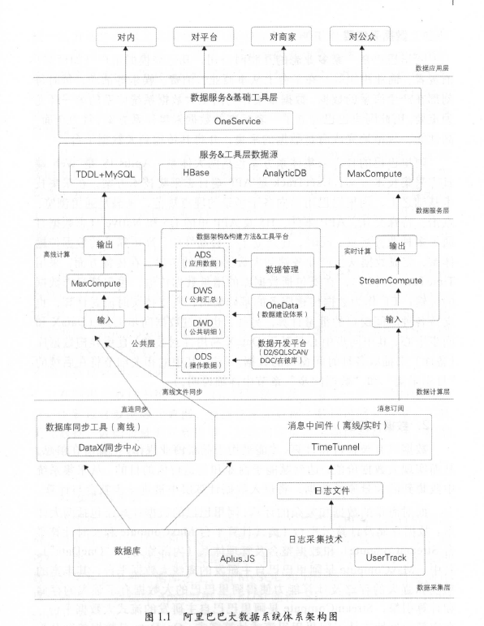

#阿里巴巴大数据之路  

####第一章 数据技术  
##### 1.阿里巴巴大数据系统架构图  
   
     

      (1) 数据采集层  
      (2) 数据计算层  
      (3) 数据服务层  
      (4) 数据应用层   

####第二章 数据模型  

####第三章 数据管理  

####第四章 数据应用  

        
             
             
    
                     
         
           
         
     
    
         
        
    